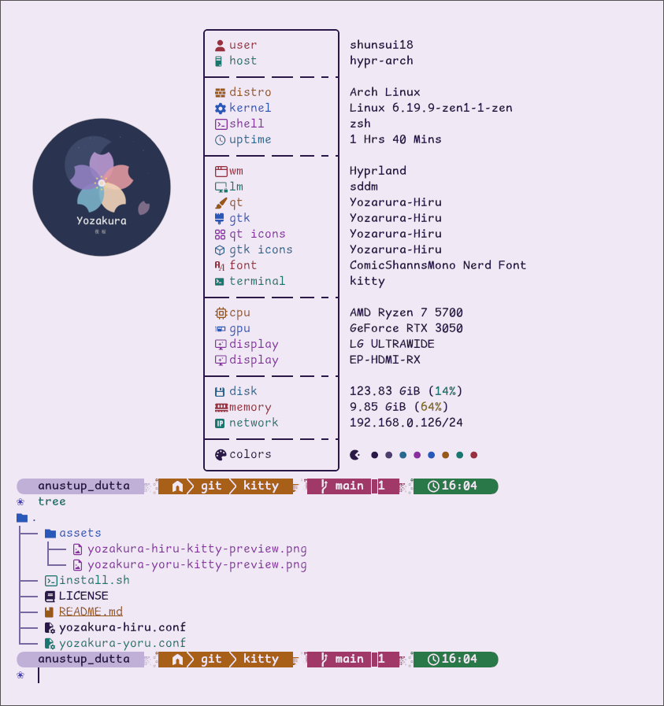

<div align="center">


# 夜桜 Yozakura — Waybar Theme

A handcrafted pastel color palette for [Waybar](https://github.com/Alexays/Waybar), based on the [Yozakura](https://shunsui18.github.io/yozakura) palette.

[](LICENSE)
[](https://github.com/Alexays/Waybar)
[](install.sh)
[](https://github.com/shunsui18/yozakura)

</div>

---

## ✦ Flavors

| | Flavor | Description |
|---|---|---|
| 🌸 | **Yoru** *(night)* | Deep, moonlit background with soft sakura accents — default |
| ☀️ | **Hiru** *(day)* | Warm ivory canvas with gentle pastel tones |

<br>

<table>
<tr>
<td align="center"><b>🌸 Yoru</b></td>
<td align="center"><b>☀️ Hiru</b></td>
</tr>
<tr>
<td></td>
<td></td>
</tr>
</table>

---

## ✦ Installation

### Interactive — One-liner

Run without any arguments to launch the guided menu:

```bash
bash <(curl -fsSL https://raw.githubusercontent.com/shunsui18/yozakura-waybar/main/install.sh)
```

The installer will walk you through picking a flavor and setting your weather location:

```
  ╭─────────────────────────────────────────────────╮
  │  ✦  Yozakura  ·  Waybar Theme Installer          │
  │     sakura petals drift through the status bar   │
  ╰─────────────────────────────────────────────────╯

     Select a theme flavour:

     [1]  Yoru  ·  夜  ·  dark
     [2]  Hiru  ·  昼  ·  light

  ❀  Choice: _

  ─────────────────────────────────────────────────

     Weather location for wttr.in:

     [1]  City name  ·  e.g. London, New York
     [2]  Pin code   ·  e.g. 700001, 10001

  ❀  Type (1/2): _

     Enter city name: _
```

---

### Non-interactive — Flags

Skip the menu entirely by passing flags directly:

```bash
bash <(curl -fsSL https://raw.githubusercontent.com/shunsui18/yozakura-waybar/main/install.sh) --theme hiru --location "London"
```

| Flag | Values | Description |
|---|---|---|
| `--theme` | `yoru` \| `hiru` | Theme flavor to activate |
| `--location` | city name or pin code | Weather location for the wttr.in module |
| `--skip-deps` | — | Skip dependency installation |
| `--skip-ddc` | — | Skip DDC monitor brightness setup |
| `-h`, `--help` | — | Show help |

---

### Manual Installation

If you prefer to clone and run locally:

```bash
# 1. Clone the repo
git clone https://github.com/shunsui18/yozakura-waybar.git && cd yozakura-waybar

# 2a. Interactive
./install.sh

# 2b. Or with flags
./install.sh --theme hiru --location "700001" --skip-ddc
```

---

## ✦ What the Installer Does

1. **Menu or flags** — launches an interactive prompt if no arguments are given, or skips straight to install when flags are provided
2. **Remote-aware** — when run via `curl | bash`, fetches all theme files from GitHub into a temporary directory with automatic cleanup; falls back to local paths when run directly
3. **Installs dependencies** — installs all required packages via `pacman`; uses `paru` or `yay` for AUR packages
4. **Bootstraps an AUR helper** — if neither `paru` nor `yay` is present, runs `scripts/chaotic-aur-setup.sh` to add the [Chaotic-AUR](https://aur.chaotic.cx) repository and installs `paru` automatically
5. **Copies config** — copies the full config tree into `~/.config/waybar/`, preserving the directory structure and setting all scripts executable
6. **Patches weather location** — writes your city name or pin code into the `wttrbar` `--location` flag in `modules.jsonc`; prompted interactively or set via `--location`
7. **Manages symlinks** — creates relative symlinks for the active flavor:
   - `color-map.css` → `styles/color-map-<flavor>.css`
   - `calander-module/clock-date-module.jsonc` → `clock-date-module-<flavor>.jsonc`
8. **DDC brightness setup** — runs `scripts/ddc-setup.sh` to configure `ddcutil`/`ddccontrol`, the `i2c-dev` kernel module, udev rules, and detects your monitor's I²C bus (skip with `--skip-ddc`)

---

## ✦ Dependencies

The installer handles all of the below automatically.

<details>
<summary>View full dependency list</summary>

<br>

| Package | Source | Purpose |
|---|---|---|
| `waybar` | pacman | Status bar for Wayland |
| `hyprland` | pacman | Wayland compositor (workspace module) |
| `rofi` | pacman | App launcher · [yozakura-rofi](https://github.com/shunsui18/yozakura-rofi) |
| `wlogout` | pacman | Logout / power menu · [yozakura-wlogout](https://github.com/shunsui18/yozakura-wlogout) |
| `playerctl` | pacman | Media controls (MPRIS module) |
| `swaync` | pacman | Notification center · [yozakura-swaync](https://github.com/shunsui18/yozakura-swaync) |
| `blueman` | pacman | Bluetooth management |
| `bluez` | pacman | Bluetooth backend |
| `pulseaudio` | pacman | Audio backend |
| `pwvucontrol` | pacman | Volume control GUI |
| `ddccontrol` | pacman | External monitor brightness control |
| `nvidia-utils` | pacman | GPU temperature monitoring |
| `jq` | pacman | JSON parsing in scripts |
| `rfkill` | pacman | Bluetooth power management |
| `wttrbar` | AUR | Weather display from wttr.in |
| `waybar-module-pacman-updates` | AUR | Pacman update notifier |

</details>

---

## ✦ Companion Themes

This bar is designed to pair with the rest of the Yozakura ecosystem:

| Package | Repo |
|---|---|
| App Launcher | [yozakura-rofi](https://github.com/shunsui18/yozakura-rofi) *(coming soon)* |
| Notification Center | [yozakura-swaync](https://github.com/shunsui18/yozakura-swaync) *(coming soon)* |
| Power Menu | [yozakura-wlogout](https://github.com/shunsui18/yozakura-wlogout) *(coming soon)* |

---

## ✦ File Structure

```
yozakura-waybar/
├── assets/
│   ├── yozakura-yoru-waybar-preview.png
│   └── yozakura-hiru-waybar-preview.png
├── calander-module/
│   ├── clock-date-module-yoru.jsonc
│   └── clock-date-module-hiru.jsonc
├── scripts/
│   ├── bluetooth-popup.sh
│   ├── bt-toggle.sh
│   ├── chaotic-aur-setup.sh
│   ├── ddc-brightness.py
│   ├── ddc-setup.sh
│   ├── gpu-temp.sh
│   ├── mpris-focus.sh
│   ├── volume-popup.sh
│   └── waybar-module-pacman-updates.sh
├── styles/
│   ├── color-map-yoru.css
│   ├── color-map-hiru.css
│   ├── yozakura-yoru.css
│   └── yozakura-hiru.css
├── config.jsonc
├── modules.jsonc
├── style.css
├── install.sh
├── LICENSE
└── README.md
```

---

<div align="center">

crafted with 🌸 by [shunsui18](https://github.com/shunsui18)

</div>
